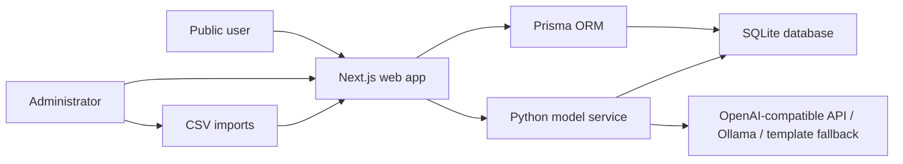
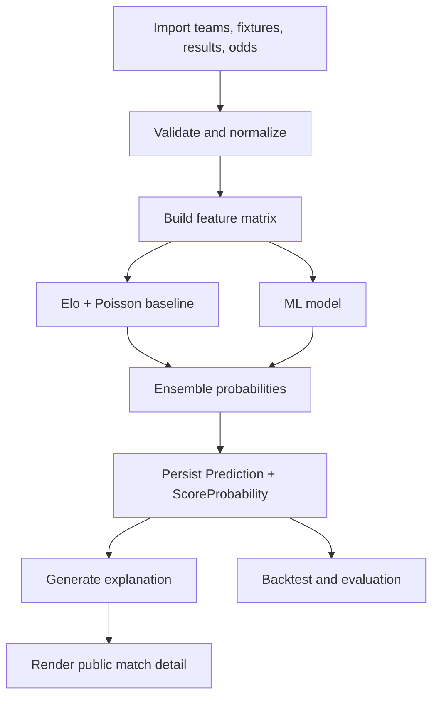

# Architecture: Football AI Prediction Platform

## 1. System Overview

The platform is a local-first production-grade web application with a separate Python model service. Next.js owns the product UI, API routes, admin workflows, and persistence through Prisma. Python owns prediction, backtesting, and model training logic.



## 2. Core Modules

### Web app

Responsibilities:

- Public competition and match pages.
- Admin dashboard.
- CSV import UI and validation feedback.
- Prediction trigger endpoints.
- Model evaluation UI.
- Disclaimer and safety copy.

### Database layer

Responsibilities:

- Store normalized football domain data.
- Preserve prediction inputs, model versions, and outputs for auditability.
- Store odds snapshots as time-series-like records.
- Support local development without external services.

### Python model service

Responsibilities:

- Build features from teams, matches, results, and odds.
- Run statistical baseline models.
- Run ML models.
- Combine model outputs.
- Generate backtest metrics.
- Request LLM explanations or generate template fallback.

### LLM provider layer

Responsibilities:

- Support OpenAI-compatible API using environment variables.
- Support Ollama local inference.
- Fall back to deterministic template explanations when no provider is configured.
- Never allow LLM output to introduce betting instructions.

## 3. Suggested Project Structure

```text
app/
  (public)/
    competitions/
    matches/
  admin/
  api/
components/
  charts/
  forms/
  layout/
  prediction/
lib/
  auth/
  csv/
  db/
  odds/
  prediction/
  safety/
prisma/
  schema.prisma
  seed/
model-service/
  football_ai/
    api/
    backtest/
    data/
    explain/
    features/
    models/
  tests/
docs/
  decisions/
tasks/
  todo.md
```

## 4. Data Model Draft

Core entities:

- `Competition`: tournament or league configuration.
- `Season`: competition instance.
- `Team`: national or club team.
- `Fixture`: scheduled match.
- `MatchResult`: final score and result metadata.
- `OddsProvider`: data source identity.
- `OddsSnapshot`: bookmaker or market odds captured at a point in time.
- `ModelVersion`: model configuration, weights, and artifact metadata.
- `Prediction`: model output for one fixture.
- `ScoreProbability`: normalized scoreline probability rows.
- `BacktestRun`: evaluation run metadata.
- `BacktestMetric`: metric values for model comparison.
- `ImportJob`: CSV import status and errors.

Important invariants:

- Prediction rows must reference an immutable model version.
- Prediction rows must preserve enough input metadata to explain and audit outputs.
- Score probabilities for one prediction must sum to approximately 1.0.
- Odds snapshots must not overwrite older snapshots.
- Public outputs must be derived from persisted predictions, not one-off ephemeral model calls.

## 5. Prediction Pipeline



## 6. API Boundaries

Internal API endpoints should be explicit and small:

- `POST /api/admin/import`: create import job from CSV upload.
- `POST /api/admin/predictions/run`: trigger predictions for selected fixtures.
- `GET /api/competitions`: public competition list.
- `GET /api/matches/:id`: match detail with latest published prediction.
- `GET /api/admin/evaluations`: backtest and model metrics.

The Python service should expose stable endpoints or CLI commands:

- `predict-fixture`
- `predict-batch`
- `run-backtest`
- `train-experiment`
- `generate-explanation`

## 7. Authentication and Authorization

V1 has:

- Public read-only pages.
- Admin-only pages and mutation endpoints.
- No ordinary user accounts.

Recommended V1 admin auth:

- Session cookie based admin login.
- Single admin user from environment variables or a local bootstrap command.
- Server-side route protection for all admin pages and mutation APIs.

## 8. Testing Strategy

### TypeScript / Next.js

- Unit tests for CSV parsing, probability formatting, safety copy helpers, and odds implied probability calculations.
- API route tests for import validation and prediction trigger authorization.
- Component tests for core probability display and empty/error states.

### Python model service

- Unit tests for Elo updates, Poisson score distribution, probability normalization, ensemble weighting, and backtest metrics.
- Golden fixture tests with deterministic sample data.

### Manual smoke tests

- Import sample CSV.
- Trigger predictions.
- Open competition list.
- Open match detail.
- Open model evaluation page.
- Verify disclaimers appear on public prediction/odds pages.

## 9. Operational Model

V1 is local-first:

- SQLite database file.
- Admin-triggered prediction jobs.
- Local Python model service or CLI invocation.
- No Redis.
- No Postgres.

Future migration path:

- Move SQLite to Postgres when concurrent writes or hosted production needs grow.
- Add Redis or durable queue when recurring odds ingestion and long-running jobs become frequent.
- Add Docker Compose when deployment needs repeatability across machines.

## 10. Risks and Mitigations

- Data provider licensing risk: keep provider interface replaceable and support CSV fallback.
- Prediction credibility risk: show backtests, calibration, model version, and data quality.
- LLM hallucination risk: feed structured model output only and apply safety post-processing.
- Betting-harm risk: keep product language analytical, not instructional.
- SQLite scaling risk: document migration path and avoid coupling code to SQLite-only behavior.
